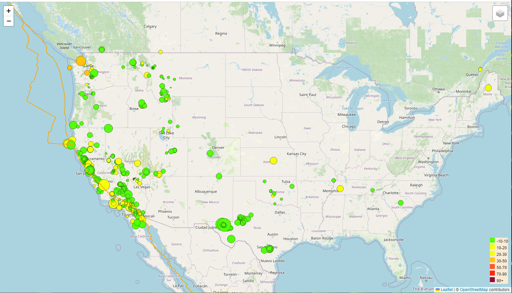
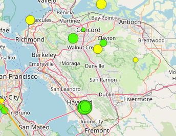
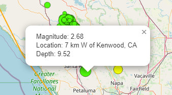
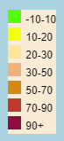
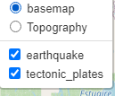

# leaflet-challenge

---
Repository file structure:
- Images Folder - Initial image files.
- README_Resources Folder -README.md images
-  static Folder
	- css Folder
		style.css
	-js Folder
		logic.js - Javascript for map visualization and features.
- index.html - Main html page.
- README.md

### This repository illustrated skills in handling:
    - geoJSON 
    - Javascript
    - leaflet
    - visualizations
---
Purpose:
Developing a visualization(map) with USGS data on earthquakes.

- map - Click [here](https://m-soriano.github.io/leaflet-challenge/) to visit the deployed site.

- Features:
    
    - Markers with size corresponding to earthquake magnitude.
    
    

    -  Popup with information about the earthquake.
    
    

    - Legend information

    

    - Overlay options:
    
    

